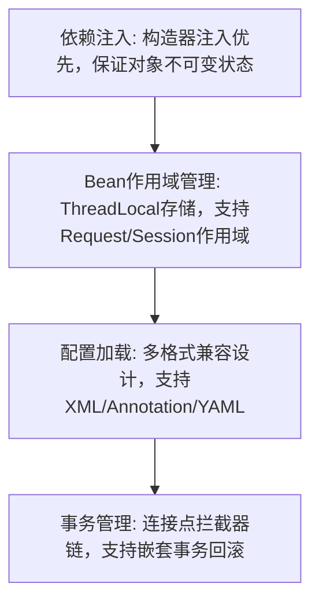
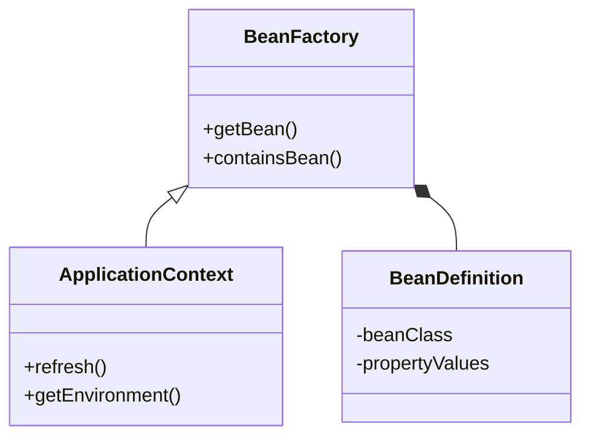

# Tiny-Spring Framework


## 项目简介
Tiny-Spring 是一个简化版的 Spring 框架，旨在深入理解 Spring 的核心原理和实现机制。本项目采用问题驱动的方式，通过实现核心功能模块，深入理解 Spring 的设计思想和实现原理。

## 核心功能
Tiny-Spring实现了以下Spring核心功能：
1. **Ioc容器**：依赖注入和控制反转
2. **AOP**：面向切面编程
3. **Bean生命周期管理**：实例化、初始化、销毁
4. **应用上下文**：配置和环境管理
5. **资源加载**：类路径和文件系统资源
6. **事件监听机制**：发布订阅模式
7. **类型转换**：基本类型和自定义类型转换
8. **Bean作用域**：单例、原型及Web作用域
9. **依赖循环支持**

---
## 模块解析

### 关键技术决策

### IoC容器架构


### AOP实现机制

1. 代理工厂采用策略模式（JDK/CGLIB动态代理）
2. 切面表达式解析使用ANTLR4
3. 通知链执行通过责任链模式实现


### 性能优化记录
Bean实例化优化
```java
// 基于原型模式的Bean缓存池
public class BeanPool {
    private static final Map<String, Queue<Object>> pool = new ConcurrentHashMap<>();
    
    public static Object borrowBean(String beanName) {
        return pool.getOrDefault(beanName, new ConcurrentLinkedQueue<>()).poll();
    }
    
    public static void returnBean(String beanName, Object bean) {
        pool.computeIfAbsent(beanName, k -> new ConcurrentLinkedQueue<>()).offer(bean);
    }
}
```

## 项目结构
````
mini-spring
```
src/main/java/com/minispring/
├── beans
│   ├── factory
│   │   ├── config
│   │   │   ├── Scope相关接口和实现
│   │   │   └── ...
│   │   ├── support
│   │   └── xml
│   ├── BeansException.java
│   ├── PropertyValue.java
│   ├── PropertyValues.java
│   └── ...
├── context
│   ├── event
│   ├── support
│   ├── ApplicationContext.java
│   └── ...
├── core
│   ├── io
│   ├── convert
│   │   ├── converter
│   │   ├── support
│   │   └── ...
│   └── ...
├── aop
│   ├── framework
│   ├── aspectj
│   ├── Advisor.java
│   ├── PointcutAdvisor.java
│   └── ...
├── web
│   ├── context
│   │   ├── request
│   │   │   ├── RequestScope.java
│   │   │   ├── SessionScope.java
│   │   │   └── ...
│   │   └── ...
│   └── ...
└── util
    └── ...
```
````

## 环境要求
- JDK 17+
- Maven 3.8.1+
- IDE（推荐IntelliJ IDEA）
- Git

## 快速开始

### 1. 获取代码
```bash
# 克隆项目
git clone https://github.com/Will-immiracle/Tiny-Spring.git

# 进入项目目录
cd Tiny-Spring
```

### 2. 编译运行
```bash
# 编译项目
mvn clean install

# 运行测试
mvn test
```

### 2.运行测试用例
项目包含完整的测试用例，覆盖了框架的主要功能：
- IoC容器测试
- AOP功能测试
- 事务管理测试

可以通过IDE或命令行运行这些测试：
```bash
# 运行所有测试
mvn test

# 运行特定测试类
mvn test -Dtest=DefaultListableBeanFactoryTest

# 运行特定测试方法
mvn test -Dtest=DefaultListableBeanFactoryTest#testGetBean
```


## 开源协议
本项目采用 MIT 协议开源，详见 [LICENSE](LICENSE) 文件。 
